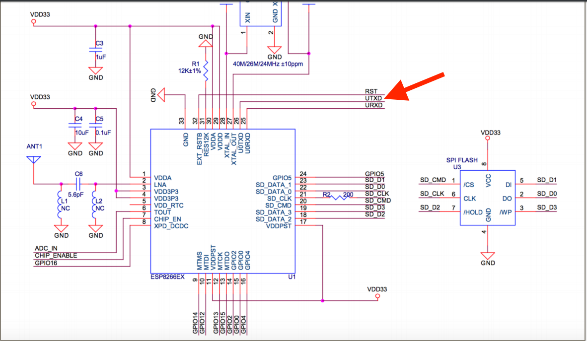
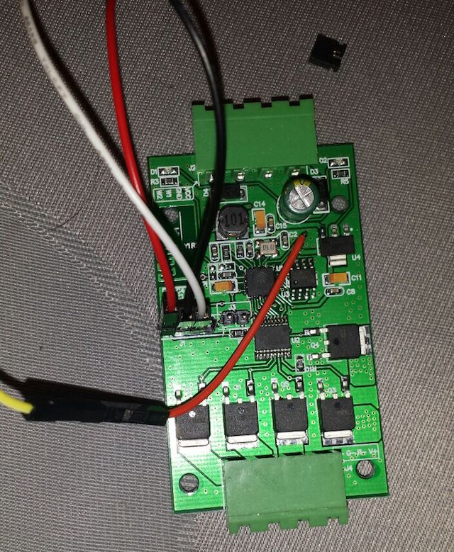

# H801 RGBW Led Controller Lua (NodeMCU) software
Openhab settings:
https://github.com/ssk181/home-switch-openhab

## Hardware
- H801 controller

## MQTT-messages
Out:

- /home/iot/{Device-IP}/out/rgb          *- HEX value, for example: FF00FF
- /home/iot/{Device-IP}/out/w1           *- HEX value, for example: FF
- /home/iot/{Device-IP}/out/w2           *- HEX value, for example: FF
- /home/iot/{Device-IP}/out/online       *- ON - connected to MQTT, OFF - desconected (LWT)*
- /home/iot/{Device-IP}/out/state/uptime *- Uptime in seconds*
- /home/iot/{Device-IP}/out/state/memory *- Free bytes memory*

In:

- /home/iot/{Device-IP}/out/rgb          *- HEX value, for example: FF00FF
- /home/iot/{Device-IP}/out/w1           *- HEX value, for example: FF
- /home/iot/{Device-IP}/out/w2           *- HEX value, for example: FF
- /home/iot/{Device-IP}/in/state/uptime  *- Empty message*
- /home/iot/{Device-IP}/in/state/memory  *- Empty message*

## H801 RGBW led controller modification
H801 RGBW controller based on ESP82266 chip and BergMicro BG25Q80ASCTG with 8Mbit (1Mb) of memory.

Controller ordered on Aliexpress:
http://www.aliexpress.com/item/DC5-24V-Smart-LED-Dimmer-Light-Controller-WiFi-APP-Controlled-Wireless-Receiver-Output-5-Routes-PWM/32636503790.html

The H801 uses the secondary TX for UART0 (GIO2), so standard NodeMCU, Arduino etc won't work.
You can modify firmware to use GPIO2 as TX, or solder pin to UART0 TX without any firmware modification.
And use normal PIN for flesh and update firmware, and soldered pin for sketch upload and debug.

## Mac OS Installation
1. Build and setup firmware integer with modules: bit, file, gpio, mqtt, net, node, pwm, tmr, uart, wifi (you can get it here: http://nodemcu-build.com/)
2. Install nodemcu-tool:
   *npm install nodemcu-tool -g*
3. Use *./upload.sh* to upload